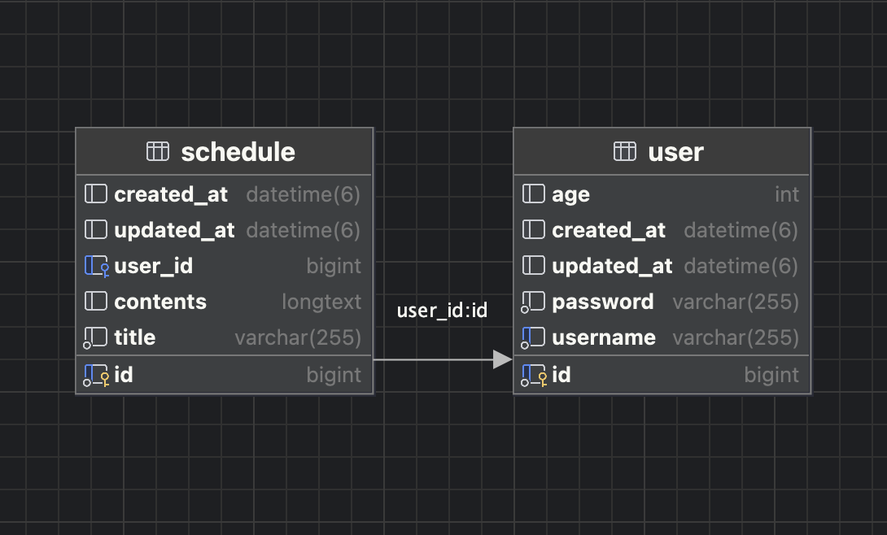

# API 명세서

## 유저 API
| 기능     | 메서드    | URL           | 요청형식 | 응답형식 | 상태코드      
|--------|--------|---------------|------|------|-----------|
유저등록   | POST   | /users/signup | json | json | 201: Created , 400: Bad Request
유저조회 | GET    | /users/{id}   | X    | json | 200: Ok , 404: Not found
비밀번호수정   | PATHCH | /users/{id}   | json | X    | 200: Ok , 401: Unauthorized


## 1. POST 요청 본문
| 이름       | 타입     | 필수여부 | 
|----------|--------|------|
 username  | String | O    | 
 password  | String | O    |
 age      | String | X    |
### 1-1 유저 등록 요청예시
```
POST /users/signup
{
    "username" : "Jack",
    "password" : "1234",
    "age" : 34
}
```
### 1-2 유저 등록 응답예시
```
{
    "id": 1,
    "username": "Jack",
    "age": 34
}
```

## 2. GET
```
GET /users/{id}      // 유저조회
```
### 2-1 유저 조회 응답예시
```
{
    "username": "Jack",
    "age": 34
}
```


## 3. PATCH 요청 본문
| 이름       | 타입     | 필수여부 | 
|----------|--------|-----|
 oldPassword  | String | O   |
 newPassword  | String | O   |
### 3-1 유저 비밀번호 수정 요청예시
```
PATCH /users/{id}
{
    "oldPassword" : "1234",
    "newPassword" : "12345"
}
```


## 스케줄 API
| 기능     | 메서드    | URL       | 요청형식 | 응답형식 | 상태코드      
|--------|--------|-----------|------|------|-----------|
스케줄등록   | POST   | /schedules | json | json | 201: Created , 400: Bad Request
스케줄 전체조회 | GET    | /schedules | X    | json | 200: Ok , 404: Not found
스케줄 특정조회 | GET    | /schedules/{id} | X    | json | 200: Ok , 404: Not found
스케줄삭제   | DELETE | /schedules/{id}     | X    | X    | 200: Ok


## 1. POST 요청 본문
| 이름       | 타입     | 필수여부 | 
|----------|--------|----|
 title  | String | X   | 
 contents  | String | X   |
 username      | String | X  |
### 1-1 스케줄 등록 요청예시
```
POST /schedules
{
    "title" : "제목9",
    "contents" : "내용9",
    "username" : "JACK"
}
```
### 1-2 스케줄 등록 응답예시
```
{
    "id": 1,
    "title": "제목9",
    "contents": "JACK"
}
```

## 2. GET
```
GET /schedules      // 스케줄 전체조회
```
### 2-1 스케줄 조회 응답예시
```
[
    {
        "id": 2,
        "title": "제목9",
        "contents": "내용9"
    },
    {
        "id": 3,
        "title": "제목9",
        "contents": "내용9"
    }
]
```

## 3. GET
```
GET /schedules/{id}      // 스케줄 특정조회
```
### 3-1 스케줄 조회 응답예시
```
{
    "id": 2,
    "title": "제목9",
    "contents": "내용9"
}
```


## 4. DELETE

### 4-1 스케줄 삭제
```
PATCH /users/{id}
```


# ERD



